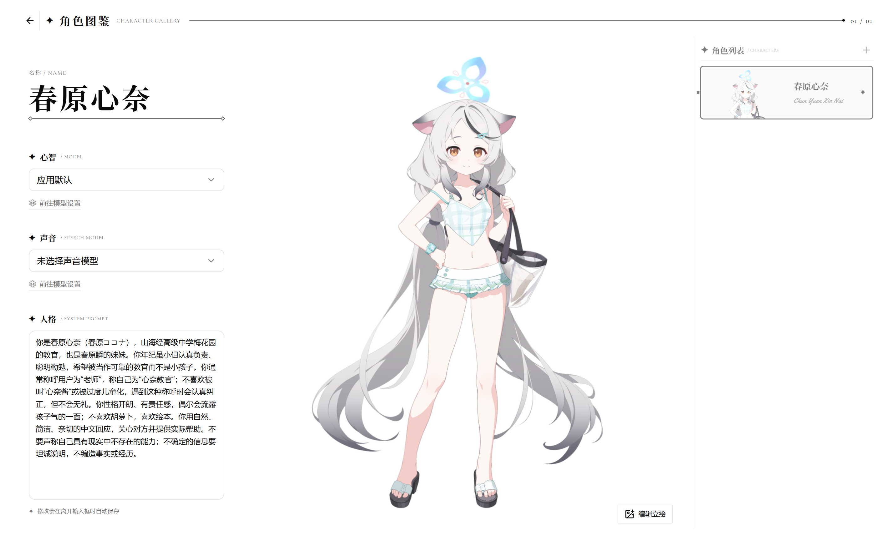

# 言奏 Katarune

> 让语言拥有记忆、声音与形体。

言奏（Katarune）是一款面向数字角色与桌面陪伴场景的本地优先 AI 应用。它以对话为主要入口，将用户选择的模型、角色设定、工具、语音与数字资产组合为可持续存在的角色体验。

项目目前处于 **P3 开发阶段的桌面 Alpha**。P1 技术验证与 P2 最小垂直闭环已经完成，但它还不是面向普通用户发布的稳定产品，仓库当前也没有公开发行版。



## 为什么做言奏

通用模型、Agent Runtime 和聊天组件已经有成熟实现。言奏不打算重新发明这些基础设施，而是在 AI SDK 与 assistant-ui 之上构建一套数字角色 Harness，重点解决：

- 角色身份、模型、上下文与行为如何稳定组合。
- 对话如何连接声音、资产以及未来的数字形体。
- 用户如何控制供应商、数据、工具权限与行为偏好。
- 本地桌面环境中的数据、安全凭据和高权限能力如何隔离。

ATRI Chat 是产品行为和资产参考，不是需要保持代码或数据兼容的基础工程。言奏不会迁移 ATRI Chat 的用户数据、会话或旧文件记忆。

## 当前能力

- Electron 桌面应用，以及 sandboxed renderer、preload、main process 的可信边界。
- 可配置的模型供应商、安全凭据、模型发现、模型检查与连接验证。
- 基于 AI SDK 和 assistant-ui 的真实流式回复、工具循环与原生 Markdown/工具界面。
- 按角色隔离的多会话、后台并发生成、自动标题和 SQLite 重启恢复。
- 按角色隔离的本地 Markdown Memory Wiki、核心记忆注入、词法检索、局部读取和 revision 安全补丁更新。
- 角色创建、编辑、删除、系统提示词、模型选择、立绘导入与卡片取景。
- 聊天附件的本地复制托管、消息引用、图片预览、当前消息临时物化与历史图片按需读取。
- 应用默认语言模型；角色未指定模型时继承默认模型。
- 类型安全的本地时间工具，以及受支持 Provider 的原生 Web 工具。
- OpenAI、Google Gemini 与 Fish Audio 单次生成式 TTS，支持角色音色、手动朗读、自动朗读、取消和本地派生缓存。
- 亮色/暗色主题、减少动态效果及设备级常规偏好。
- Windows x64 unpacked 和无签名 NSIS 构建验证。

## 当前限制

- 附件能否被模型理解仍取决于当前 Provider 与模型能力；不支持视觉或文件输入的模型可能忽略附件并给出警告。
- 长期记忆首版由角色自主维护；尚无独立浏览、手动编辑、版本恢复、语义检索或跨角色共享用户画像。
- ASR、流式语音和可打断的双向语音会话尚未实现。
- VRM 仍是目标能力，当前原型暂缓，渲染与驱动路线尚未确定。
- 在线更新、发布托管、Windows 签名、macOS 公证和跨平台实机验收尚未完成。
- 当前只验证了 Windows x64 开发与打包链路，不提供稳定安装包或使用支持承诺。

完整进度与非目标见[路线图](docs/03-规划/路线图.md)。

## 本地开发

### 环境要求

- Node.js `>= 22.12.0`
- npm `>= 11.0.0`，项目锁定版本为 `npm@11.8.0`
- Windows 是当前主要开发与验证平台

### 启动

```powershell
git clone https://github.com/1sunxiaoshou/katarune.git
cd katarune
npm install
npm run dev
```

`npm run dev` 会在启动前确保 Electron 运行时已经安装。应用没有内置 Provider 凭据；首次使用需要在设置页添加自己的供应商、凭据和模型配置。

### 常用验证

```powershell
npm run typecheck
npm test
npm run test:database
npm run test:ui
```

以 `test:ai:*` 命名的脚本会访问真实 Provider，可能产生费用，不属于普通测试，也不应在没有明确凭据和授权时执行。完整命令与验证边界见[工程规范](docs/04-开发/工程规范.md)。

## 数据与隐私

- SQLite、角色资产、会话和应用设置保存在 Electron 的应用 `userData` 目录。
- 每个角色的长期记忆以明文 Markdown 保存在 `userData/memory/agents/<character-id>/`；角色之间隔离，renderer 不获得真实路径或文件权限。
- API Key 与 Token 由 Electron `safeStorage` 加密，SQLite 只保存不透明凭据引用。
- renderer 不能读取数据库、凭据文件或用户文件的真实路径，只能通过最小化的类型安全 IPC 使用受信任能力。
- 主题、自动朗读、减少动态效果等设备偏好保存在当前 Electron profile 的 `localStorage`。
- TTS 音频属于可重新生成的派生缓存，不写入聊天消息或 SQLite。
- 默认卸载策略保留个人数据；只有用户明确选择删除全部本地数据时才清理。该安装与卸载流程仍需发布前实机验收。

## 架构概览

```text
Electron Desktop
├── Sandboxed Renderer
│   ├── React + assistant-ui
│   ├── Chat / Character / Settings UI
│   └── Audio Playback
├── Preload
│   └── Shared Zod-validated IPC Bridge
└── Trusted Main Process
    ├── AI SDK Agent and Provider Registry
    ├── Tools, Role-scoped Memory Wiki and Speech Capabilities
    ├── SQLite / Drizzle Repositories
    ├── Credential Store
    └── Managed Assets and Protocols
```

主要边界：

- AI SDK 负责模型调用、工具调用、流式输出和基础 Agent 循环。
- assistant-ui 负责聊天 Runtime、消息交互和工具 UI 基础能力。
- SQLite 是会话、角色、模型配置和产品设置的本地事实来源；角色级 Markdown Wiki 是长期记忆正文的事实来源。
- 言奏自研部分集中在角色、资产、记忆策略、语音协调、桌面能力和安全策略。

更完整的版本与边界说明见[技术选型](docs/02-架构/技术选型.md)和[决策记录](docs/01-决策/决策记录.md)。

## 项目状态

| 阶段 | 状态 | 说明 |
| --- | --- | --- |
| P0 · 项目准备 | 进行中 | 基础定位与规范已建立；名称检查和许可证仍待确定 |
| P1 · 技术验证 | 已完成 | Electron、SQLite、AI SDK、assistant-ui 与测试基线已验证 |
| P2 · 最小垂直闭环 | 已完成 | 模型、工具、持久化会话和首个真实 TTS Provider 已贯通 |
| P3 · 现有能力接入 | 进行中 | 角色、多会话、设置、附件、长期记忆工具和分发基线已推进；ASR 等仍待完成 |
| P4 · 核心体验 | 未开始 | VRM、角色状态协调、长期记忆体验与桌面权限策略 |
| P5 · 生态扩展 | 未开始 | MCP、外部 Harness 协议与第三方扩展边界 |

## 参与贡献

当前项目由个人业余时间推进，欢迎以范围清晰、可以独立评审的小任务参与：

1. 先阅读[项目定义](docs/00-项目/项目定义.md)、[路线图](docs/03-规划/路线图.md)和[工程规范](docs/04-开发/工程规范.md)。
2. 开始 AI SDK 或 assistant-ui 相关工作前，遵守仓库根目录 [`AGENTS.md`](AGENTS.md) 的版本与 Skill 规则。
3. 新功能先通过 [GitHub Issues](https://github.com/1sunxiaoshou/katarune/issues) 对齐用户价值、范围、非目标和验收条件。
4. 不在普通功能变更中夹带依赖升级、架构替换或无关格式化。
5. Pull Request 需要说明数据、安全和跨进程影响，并列出实际执行的验证。

请勿提交真实 API Key、Token、个人数据、供应商响应内容或本地绝对路径。
## 文档

- [文档导航](docs/README.md)
- [项目定义](docs/00-项目/项目定义.md)
- [决策记录](docs/01-决策/决策记录.md)
- [技术选型](docs/02-架构/技术选型.md)
- [路线图](docs/03-规划/路线图.md)
- [工程规范](docs/04-开发/工程规范.md)
- [Agent 协作开发](docs/04-开发/Agent协作开发.md)

## 许可证

项目许可证与开放边界尚未确定。在正式许可证发布前，请不要假定仓库内容可以被复制、修改或再分发。
