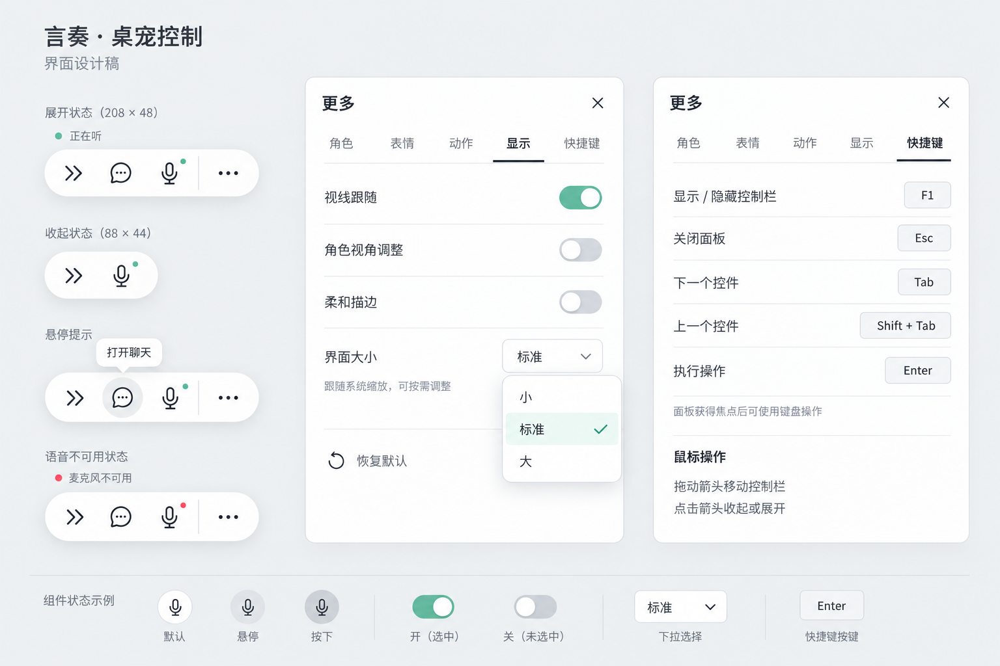

# 桌面交互设计

> 状态：D-061 的桌宠快捷排与全双工语音代码已接入；Unity Player 的耳机、外放、屏幕边角和 DPI 实机验收待完成。正式摄像机操作与全屏世界态仍待决定。

## 当前桌面切片

现有 Electron 聊天窗口是唯一文字输入和完整历史界面。用户连接桌宠后，Unity 绑定当前角色和会话，自动开启麦克风；同一会话的语音转写直接发送到既有 Agent 和历史。聊天栏的麦克风按钮只做一次听写并将识别结果填入草稿，不启动桌宠语音。

Unity 胶囊控制栏使用常规双箭头拖动及收起，向屏幕内侧展开单层设置面板。其余图标依次为“聊天、麦克风、更多”。“聊天”打开现有 Electron 窗口；麦克风按钮在本次连接内开启或关闭持续收音；“更多”提供角色、表情、动作、显示、快捷键五个 Tab。关闭桌宠后重新连接会重新自动开启麦克风。当前不开发 Unity 文字输入框或“进入世界”按钮。

角色说话期间继续收音。检测到持续人声时暂时暂停当前音频、口型和字幕时钟；空识别恢复原位置，最终转写确认后清掉旧轮未播音频与表演，并优先于待发文字消息进入同一聊天会话。已生成的完整助手回复保留在历史中并标记“播放已打断”；生成超过 10 秒则取消，保留部分内容并标记“生成未完成”。具体协议与边界见 [D-061](../01-决策/决策记录.md#d-061--桌宠全双工语音与确认式插话)。

## 状态、字幕与穿透

麦克风开启状态即使快捷排收起仍可见。不再在控制栏上方重复展示状态文字和圆点；准备、收音、识别、等待、角色说话、静音和错误通过麦克风按钮说明展示；错误提示可通过麦克风按钮读取并手动重试。底部字幕区域：用户最终转写用“你：”与浅白样式，角色对白用深色字幕；控制栏不常驻显示音量条。按钮、开关、下拉框和溢出滚动区接收输入，其余透明区域继续穿透。原生下拉菜单展开时，短暂接收外部点击以关闭菜单；关闭或隐藏 HUD 后立即释放。

字幕位于屏幕下方居中区域，正文居中，角色字幕使用中性深灰背景和白色正文。无 TTS 时按阅读时长分页；有声对白由 Unity AudioSource 游标推进字幕和口型。打断暂停时不推进这些时钟，恢复后从原位置继续。

## 边界与后续

桌面态与未来全屏世界态共享角色与对话状态，但世界态玩法、入口和过渡尚未决定。当前展示转台用于检查模型、动作、材质和取景；正式桌面摄像机是否固定、开放哪些旋转与缩放操作，依据构建和实机体验再决定。多显示器、设备选择、全局快捷键、流式文本输入与复杂外放回声场景留待后续评估。

## HUD 视觉基准

上述图像保留为布局参考；控件和动效以主程序现有样式为准，运行效果以 Unity 截图验收。控制栏采用无描边白色背景，208 × 48 逻辑像素，收起为 88 × 44；四个图标来自项目锁定的 Lucide，统一 24 × 24 SVG 画布、2 单位线宽和 16 像素显示尺寸，保留 36 像素点击区域。“更多”前的分隔线为 2 × 12、圆头。设置面板宽 360、高至多 480，并按可用工作区缩小。字号以 14 为正文、18 为标题、12 为辅助说明；配色映射 renderer/styles.css 的亮色中性色，正文 #0a0a0a、辅助说明 #737373、边线 #e5e5e5、悬停 #f5f5f5、主色 #171717。开启的设置开关和选中项用黑色，绿色只用于收音状态提示。

设置页复用原生 Toggle 和 DropdownField；Unity 开关轨道采用 32 × 20、滑块 16 × 16、两端留白 2 的整数尺寸，焦点边框始终预留空间，避免直接照搬 Web 的 18.4 像素高度后产生取整偏移；界面大小为紧凑单选下拉框，快捷键独立成页。显示页在常规尺寸下完整展示，不为短内容制造滚动条；长动作库和小工作区保留窄灰滑块。

`AvatarHud.uxml` 管理结构，`AvatarHud.uss` 管理布局，`AvatarHudTheme.uss` 统一控件主题，`AvatarHudMotion.uss` 管理短过渡。C# 保留 Facade/语音意图绑定，布局与过渡各自独立；`AvatarHudPopup` 仅补齐原生弹出层的主题继承、关闭与透明窗口命中，不另造菜单系统。

视觉状态按语义分配：聊天、加载、重置等一次性操作仅有默认、悬停、按下，以及确实不可用时的禁用态，不保留选中态。开关保留开/关，Tab 和表情保留当前项，“更多”只在展开期间保留入口底色。焦点提示仅在键盘导航时出现，鼠标点击不会留下描边；图标按钮沿用主程序 TooltipIconButton 的轻微按压缩放，文字按钮沿用 Button 的 1 像素下移。“更多”展开时入口保留浅灰背景；Tab 采用与 SettingsPage 相同的黑色选中块，并在标签下方连续移动，内容从下方 6 像素淡入。开关滑块与底色一起切换；提示采用黑底白字并保留退出过渡。面板从控制栏所在方向淡入、95% 缩放展开，退出立即停用命中，快速重开取消旧退出任务。

动效基准来自现有 Web 组件：按钮/开关 150 ms，弹层 100 ms，设置内容 220 ms，Tab 选中块 280 ms。Unity 使用原生 USS 的 ease-out-cubic 近似 Web 设置页的 cubic-bezier(0.22, 1, 0.36, 1)，不声称曲线逐帧相同；不引入第二套动画库。本次对齐亮色视觉与交互状态；应用主题和“减少动态效果”偏好的跨进程同步仍需单独接入。

mini 控制栏和菜单卡片使用同一紧凑阴影：四周至多 2 像素的极淡环境阴影柔化边缘，叠加下方至多 6 像素的投影；底部稍明显，避免宽而均匀的全向光晕。阴影只作绘制、不参与命中。菜单外壳采用 12 像素圆角，不叠加细描边或外壳裁切；滚动内容仍由原生 ScrollView 裁切，避免圆角边线出现断缝。
